# Falling_Bodies
Investigation of falling bodies using raylib, and my own RK4 Numerical Integrator
====================================================================================

We all know the algebraic form of equations of one-dimensinal, falling motion: 

$\large y(t)=y_{0}+ \nu_{0}t + \frac{1}{2}at^{2}$

where, on Earth, 

$\large a = -g = -9.81 \frac{m}{s^{2}}$

Today, we are going to investigate this with the Runge-Kutta 4th Order Numerical Method

Let's imagine 3 separate, 2-dimensional rectangles. The red rectangle, is computed algebraically

The blue and orange rectangle will be computed using 4th Order RK-4

The red, blue, and orange masses respectively are

$m_{r} = 1.0 kg$ $\hspace{0.5cm}$ $m_{b} = 1.0 kg$ $\hspace{0.5cm}$ mass $m_{o} = 2.0 kg$

I'd like to demonstrate two things with these graphs

## 1: Smaller masses are negligable in a planet's gravitational field

Therefore, all objects that are relatively "small" (non-planet or moon-sized) fall at the same rate. Let's investigate what this depends on.

Isaac Newton proved that

$\large F = ma$

and, more importantly for the planet mass M, and in our case, much smaller mass m, with universal gravitational constant G, and the radius of the planet, R

$\large F = \frac{GMm}{R^{2}}$

This mathematical statement is saying the Force being exerted upon an object, is the right side of the equation, and that's why this object falls toward the planet.

But pluggin in $F$ \hspace{1cm} from above

$\large \frac{m}{a} = \frac{GMm}{R^{2}}

As one can see, dividing both sides by $m$

Where $a = \ddot{y}$

$\large \ddot{y} = \frac{GM}{R^{2}} = -9.81 m/s^{2}$

Note: One meter here in this world is one pixel, so we are looking at an object that is 10 meters wide, and 10 meters tall, from relatively far away

## 2: With smaller step-sizes, RK-4 is a very powerful method of Numerical Integration for smooth, continous solutions

### h = 1

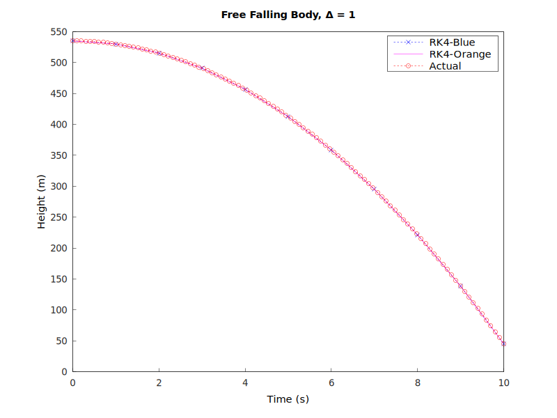

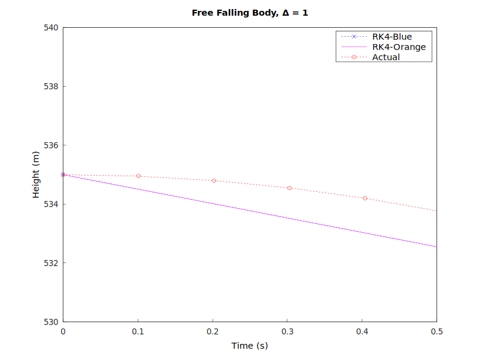

Zooming in, one can see that the RK-4 prediction is pretty far off from what it's supposed to be

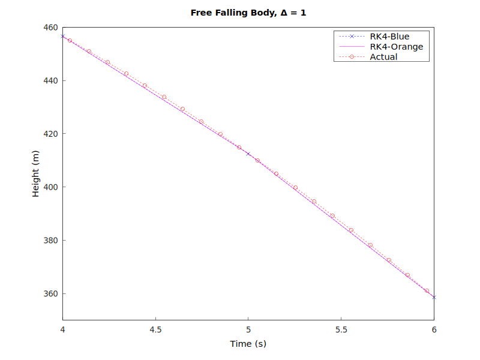

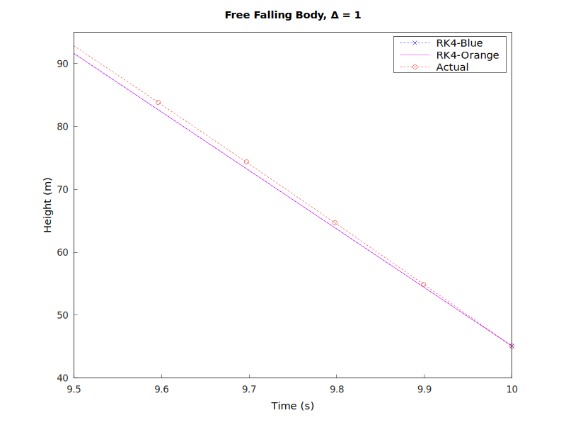

But we can tell that these objects of different masses fall at the same time (they are in a vacuum)

Let's see what happens shrinking the step size to h = 0.1, and 0.00001

### h = 0.1

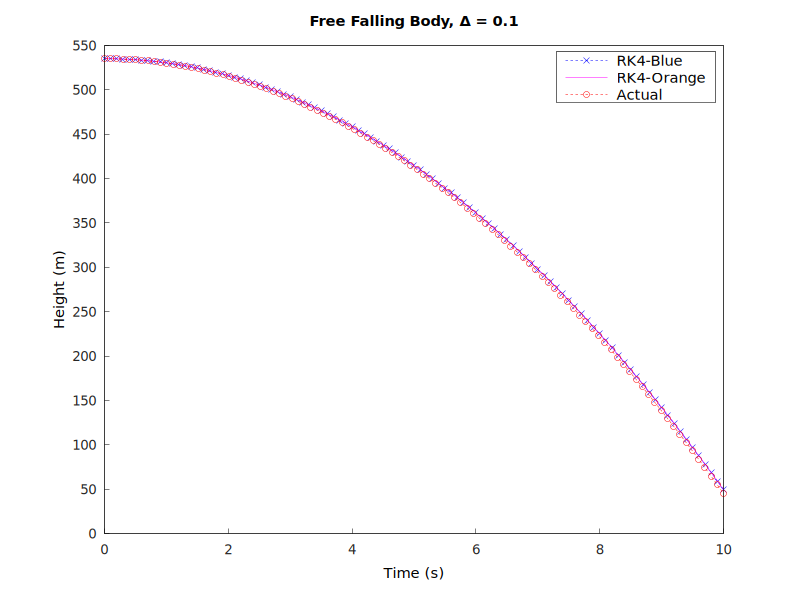

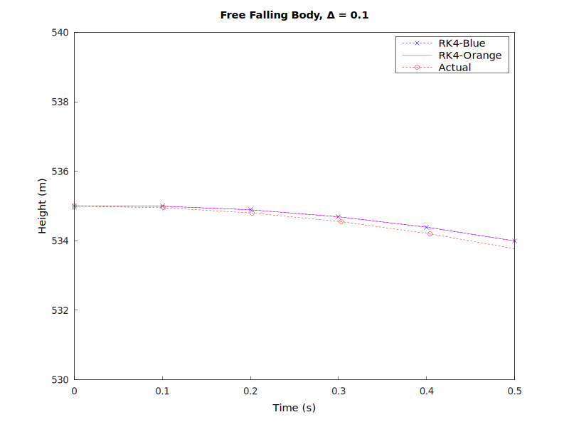

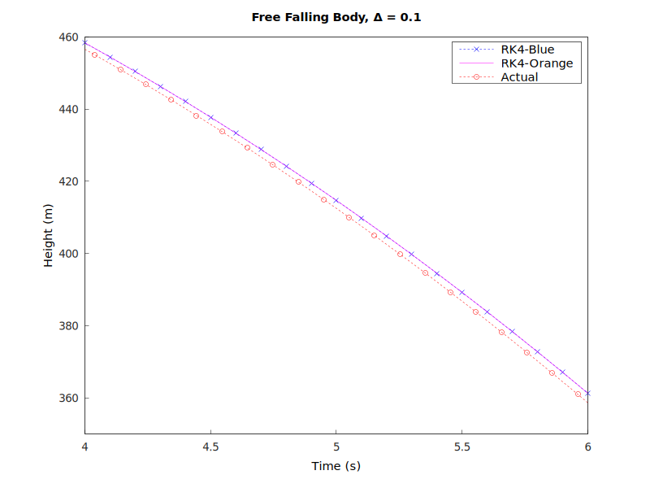

### h = 0.00001

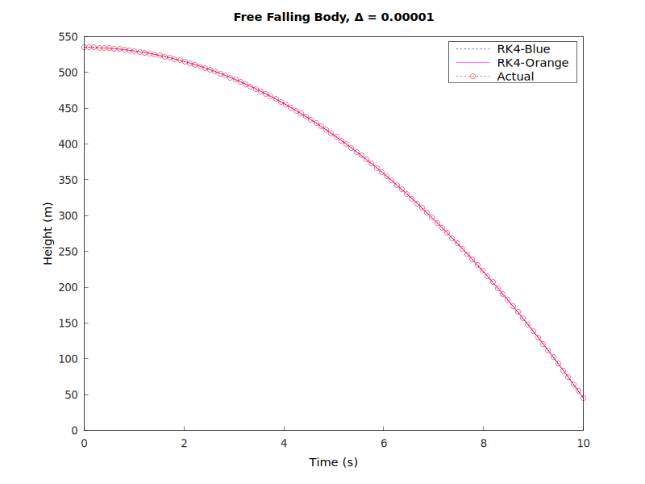

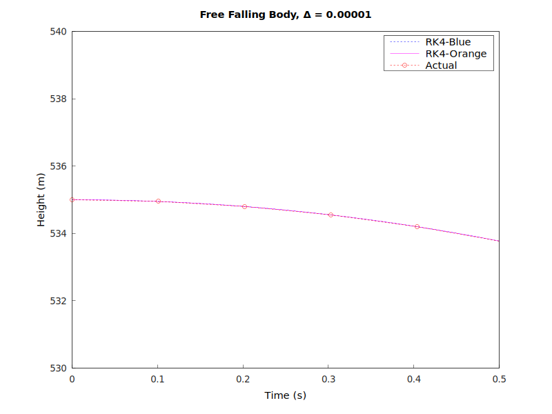

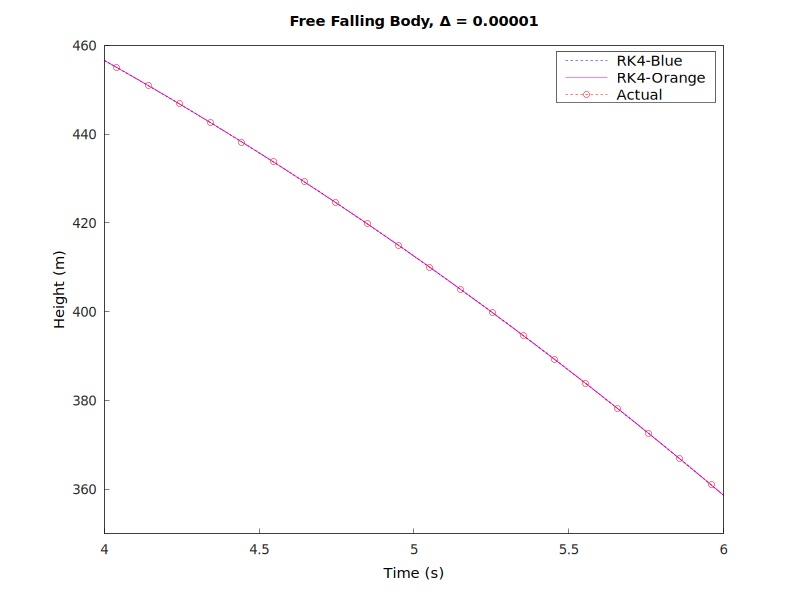

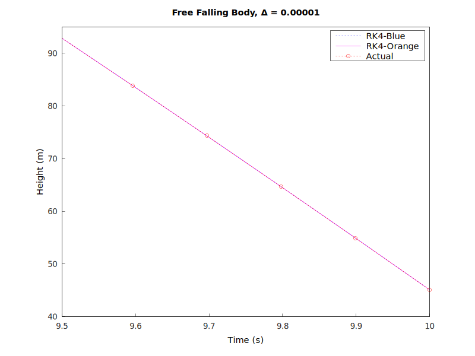

We can see two things by zooming in. One, the step size get's really small, the RK-4 Numerical Method is a great tool for predicting solutions.

And two, the orange and blue rectangle of different masses, both using RK-4 integration, are predicting the exact same results!

